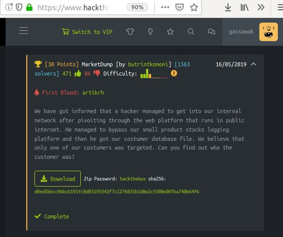
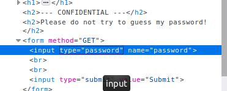

## DEFENSE AGAINST THE DARK ARTS
### CS373 - SUMMER 2019
 
[Week 2](index.md)  [Week 3](week3.md)  [Week 4](week4.md)  [Week 5](week5.md)  [Week 6](week6.md)  [Homework 3](homework3.md)
[Week 7](week7.md)  [Week 8](week8.md)

  
## Final: Hack The Box

Hack The Box (HTB) is an online platform for testing and advancing your penetration skills. Challenges range in difficulty so hackers of all skill levels are welcome. HTB has their own private messaging system and forums so that you can get hints and encouragement along the way. I'll cover obtaining an HTB account and three challenges.
 

### Obtain HTB Account

To join HTB go here:  https://www.hackthebox.eu/invite

To get an account with HTB takes more work than simplly entering an email and password. This site is for practicing penetration skills so it's fitting that you need to hack your own way in. More specifically, you have to generate an invitation code.

For my first attempt to create my invite code, I wanted to do something silly and see what happens. My inspiration was from the Little Bobby Tables comic on SQL injection and a character from Stranger Things. “Barb’); DROP TABLE USERS” as I expected, didn’t do anything but return an invalid invite code message.

 
  

My next attempt used some SQL injection that would hopefully evaluate to true and get me authenticated. Unfortunately, this returned some unwelcomed results. I was temporarily blocked by HTB.

  

  

Once, I was unblocked I inspected the Sign-Up page and noticed a source script “/js/inviteapi.min.js” that looked promising. 

  

I entered the path and found the source code and saw a function called “makeInviteCode”. That's exactly what I wanted to do.

  

Back on the original sign-up page in the console, I entered “makeInviteCode()”. The response included a string in the data entity. 
  

  

I attempted to use the string as the invite code but that failed. The encrypt type of the string is Base64, so I went to a site to https://www.base64decode.org/ to decode, and the following instructions were decoded: “In order to generate the invite code, make a POST request to /api/invite/generate.

  

Using Postman I made the POST request, which returned a code. 

  

This code did not work on the sign-up page, so I went back to the decode Base64 page. Once decoded, I went back to the sign-up page and successfully signed up to HTB! Once you have successfully created your invite code, you may create a user account. Don't worry, you won't have to create your own invite code each time you want to login.

  

#### Before you get started, it's important that you read the rules so that you don't get into any legal trouble. It's also highly recommended that you use a virtual machine and vpn using the provided connection pack as HTB cannot gaurentee that the site or the files contain no malicious content. The vm I built runs Ubuntu using VirtualBox.
   

### MarketDump      by butrintkomoni    \[30 Points]

"We have got informed that a hacker managed to get into our internal network after pivoiting through the web platform that runs in public internet. He managed to bypass our small product stocks logging platform and then he got our costumer database file. We believe that only one of our costumers was targeted. Can you find out who the customer was?"

MarketDump is a Forensics challenge. The zip file contains a pcapng file, a network traffic dump file. If you open in a text editor or cat out in your terminal, you will see thousands of American Express card numbers listed. While scrolling through the card list I found one credit card number that stood out - it was alphanumeric and over twice the length of the other card numbers. This must be the customer who was targeted so I copied the string to a text file.

  

Easy 30 points, I thought, just decode the string using Base64 and get the flag to submit. Wrong. Decoding using Base64 returns invalid input.

  

I heard about the toolkit website for decryption, [dcode.fr](https://www.dcode.fr/about), from a classmate, and attempted to decode the string using Base26 and Base36. Unforetunately, both of these resulted in garbage. The flag to submit needs to be in the format of HTB{...}.

  

I searched for other decoding tools online and found [CyberChef](https://gchq.github.io/CyberChef/), an open source web tool designed for decoding data. This tool can automatically determine which method to use to decode your input, perhaps based on the combination of the input itself and the output after decoding. I placed the string in the input, kept Auto Bank checked, hit bake, and the decoded flag appears! 

  

CyberChef lets you know what method they used to decode the text. In this case it was Base58, which I was not familiar with. Base58 is an alphanumeric set of characters that leaves out letters and numbers that are more difficult to transcribe, such as 0, O, I, l. Base58 is used in bitcoin transactions (https://learnmeabitcoin.com/glossary/base58).

Input the flag in the MarketDump challenge and submit. We have successfully found the one victom whose credit card information was compromised.

   

### misDIRection      by incidrthreat    \[20 Points]

"During an assessment of a unix system the HTB team found a suspicious directory. They looked at everything within but couldn't find any files with malicious intent."

misDIRection is a Miscellaneous challenge. Before extracting the zip file, several folders can be seen in the zip but all with 0 bytes size. The folders are each named using one character from the Base64 set, except for the characters "+" and "/".

  

Opening up the subfolders, some have files with no file size, and others are empty.

  

Once the file is unzipped, none of the folders or files are visible in the directory. Perhaps they are all hidden, which is a technique sometimes used for making malicious content difficult to find.

  

Using *ls -a* in the terminal in the directory where the file was unzipped, we can see the ./secret folder. And then we can *ls* to see the subdirectories and files.

  

Back in the file manager, I didn't see the .secret folder. I checked the Show Hidden Files option and the folder appears. We can see the subdirectories as well.

  

  

By hand, I wrote all the folders and then each file name or names, which are numbered 1 through 36, that reside in each folder. After a few minutes of reviewing, I noticed that none of the file names/numbers repeat. I realized this must be a code using Base64. I transcribed the code using the character from the folder in order of the file numbers starting with 1.

  

I saved the text in a file, decoded using Base64 in the terminal to come up with the solution flag.

 

   

### Lernaean      by Arrexel    \[20 Points]

"Your target is not very good with computers. Try and guess their password to see if they may be hiding anything!"

Lernaean is a Web challenge. Using FireFox I got the instance started, navigated to the provided site (made sure to remove spaces and the word "port"). Although the site explicitely says not to try to guess the admin password, I tried all the same using: ' or '1'='1' --' (SQL injectioin that would hopefully evaluate to TRUE), ?????????????????????????????? (attempting a buffer overflow), admin, and adminpw (worth a shot). "Invalid password" was returned with each attempt.

  

Next, I tried navigating to the paths "/admin", "/password", and "/login" but status 404 - Not Found was returned with each.

  

I then inspected the input field of the page, and changed the input type from "password" to "user" and name from "password" to "user" hoping to break the validation. However, "Invalid password" returned when submitted. 

  

I changed the method from a POST to a GET, to perhaps bypass the validation altogether. Again, same result when submitted.

  

I decided to use Burp Suite to intercept the POST request. Burp Suite is a web application security testing application, that offers a free Community version that is capable of intercepting requests and responses, making repeat requests, editing requests, decoding, and lots more (https://portswigger.net/burp). Intercepting requests requires setting up a proxy server in the browser settings. Once the proxy server was set, I navigated to Proxy and Intercept in Burp Suite and turned Intercept to on. Then, when back to the login page I entered some garbage and submitted. The POST was intercepted and we see the request to the website, including the destination IP address and port number.

  

I decided to try to brute force the password but had to look up how to do so. I read about a tool called Hydra, a password cracking tool. I wanted to learn more about Hydra before using it and when I looked it up, one of the search results was for the Greek mythological monster Lernaean Hydra. Since the name of the challenge is Lernaean, I figured I was on the right track.

  

I installed Hydra and a common password list provided by Kaggle (rockyou.txt). Then ran Hydra against the list for the destination IP address and port obsevered previously.

  

See in green the password is "leonardo"! I entered it into the login and the page returned the following.

  

I decided to intercept the login POST again using Burp Suit but this time with the found password.

  

In the HTTP history, we see the POST requests made and also the GET request that returned the Oops! Too slow! with the path /noooooooooope.html. I sent the last POST request to the repeater so that I could analyze the response. 

  

After sending the request and looking through the response, you can see the flag "HTB{l1k3_4_b0s5_s0n}" in the first heading tag. I just completed my first brute force attacke!

  

  
