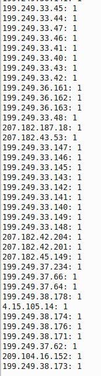

## DEFENSE AGAINST THE DARK ARTS
### CS373 - SUMMER 2019
 
[Week 2](index.md)  [Week 3](week3.md)  [Week 4](week4.md)  [Week 5](week5.md)  [Week 6](week6.md)  [Week 7](week7.md)

  
## Homework 3:  Header Analysis

A lot can be gleaned from analyzing network traffic packet headers. Including what type of network, if it's under attack, who is communicating with who, what services the network provides, and more. We'll write Python scripts to analyze two different collections of network packets to determine the main functions and kind of each network (e.g. work, home, data center, ISP).
  

### Find Statistics on TCP and UDP Services

First we build a script to examine TCP and UDP and port number counts.

Extend your script’s statistics gathering to count the use of all well-known destination port numbers for TCP and UDP (ports 1-1024).  For example, you should be able to look up in your output how many TCP packets have destination port 80 and how many UDP packets have destination port 53.  Run your new script on R and O data.  Enable this function using a ‘-stats’ flag (i.e., the script should have no output unless there is a -stats flag in the command line).

 

 

Based on this information, characterize the main functions on each network.  What kind of a network is it? (e.g., work, home, data center, ISP)

*R.csv*
Almost all packets are sent via TCP or UDP protocols. A lot of traffic using TCP on port 139, which is typically used for computers to talk to each other on the same network. For TCP traffic, there is also http requests, email, telnet, printer service requests. The majority of UDP traffic is Domain Name Server requests, with the rest for NetBIOS and DHCP requests. 

This is most likely a corporate office or work network.

 

*O.csv*
TCP and UDP make up most of the traffic flow, with some GRE (Protocol 47 Generic Route Encapsulation – used for VPN) and ESP (Protocol 50 Encapsulating Security Payload – provides authenticity, data integrity, and confidentiality) (https://en.wikipedia.org/wiki/List_of_IP_protocol_numbers).

Most of the TCP packets are used for email routing between mail servers (SMTP), HTTP, and 
Secure Shell (SSH).  With fewer file sharing, NetBIOS session service, end point mapping, and Quick UDP Internet Connections. There are fewer UDP than TCP requests, with most of them going through DNS port. 
Based on this information, I would say that this is likely a data center that supports email services.

 

  

### Investigate IP Addresses

Add to your script an option called “-countip” which creates list of distinct IP addresses with their usage counts.  Sort the list by the usage count, not by the IP address.

 

 

Run your countip script on R and O data.  Does this inform your answer in [2]?
Attempt to determine the network number (network prefix) that seems to dominate the traffic.

*R.csv*
My answer for 2 was “This is most likely a corporate office or work network.” And I stick by that answer. Most of the IP addresses start with the same prefix, indicating they are behind an NAT. Also, since there are around 100k packets in R.csv and only 33 distinct IP addresses, it’s not a home, a datacenter, or an ISP. A home would likely have fewer IPs behind their router. A datacenter would have more IP addresses requesting data. 

The network prefix appears to be 10.5.63.xx, which falls in the range of private addresses that are reserved for internal use behind a router or other Network Address Translation (NAT) device (https://www.lifewire.com/what-is-a-private-ip-address-2625970).

  

*O.csv*
My answer for 2 was “a data center that supports email services.” And I stick by that answer. There are 17,004 distinct IP addresses listed for 1M packets. There are several addresses that have very high counts, and then there are lots of addresses that have only have a handful of counts, meaning the requests are dispersed. It’s clearly not a home. 
The network prefix appears to be 192.245.12.xx.

 

 

  

There are some IP protocols that are typically used between routers or other special networking devices.  Traffic from these protocols can identify the infrastructure of the network under observation.

Generate sorted output from ‘-countip’ for the IP protocols to identify all the IP addresses that use:
* GRE (Generic Routing Encapsulation) – this is used to create tunnels between networks with overlapping address spaces.  It is also the base protocol for PPTP, a remote access mechanism.

* IPSEC – this is the protocol that creates virtual private networks, creating an overlay network structure on top of the Internet.  Most IPSEC is router-router these days.

* OSPF – Open Shortest Path First routing protocol.  This is the ‘standard’ routing protocol for Internet routers, allowing them to discover the topology and choose the best routing paths as connections between routers appear and disappear.

 

*R.csv*
There is no output for R.csv because none of the packets use any of these protocols (See screen shot for question #2.)

 

*O.csv*
Protocol 47 is the Generic Routing Encapsulation (GRE). When we filter the O data for it, we see 4 IP address that use this protocol.

 

Protocol 50 is IPSEC and is used by 15 IP addresses.

 

Protocol 89 is for OSPF and is used by 6 IP addresses.

 

Find another network prefix that also seems to be associated with this traffic.

*R.csv*
Again, there is no traffic using these protocols for R.

*O.csv*
For O, there are a few network prefixes that seem to be associated with this traffic. GRE is uses 209.204.16.0 and 198.182.113.0 frequently. Both of these are used with the IPSEC protocol as well. IPSEC also contains another network prefixes, 207.182.0.0, that is also used by the OSPF protocol.

Does the OSPF information inform your answer as to what kind of network these are?

For R, I’m keeping my guess that this is a corporate office the same since there is no OSPF usage.

For O, I’m sticking with my answer from a data center for email services. The fact that it uses OSPF would suggest it’s either a data center or ISP.
  

### Find the Servers

The server machines are the main assets of each site.  Can we find them?
To find the ‘stars’ in the diagram, we want to find IP addresses that are the destination of many transactions.

 

  

Run your -connto option on R and O data  (ignore anything that ends in .255 – this is a broadcast address). Return the top 20 servers from your ‘connto’ output.

Does this suggest a set of servers to you? 

For the R data, identify the web servers, the printers, the mail servers, the DNS servers

*R.csv*
If we ignore the broadcast addresses, we see a list of servers beginning with “10.5.63.xxx”, which are private IP addresses.
* 10.5.63.7 and 10.5.63.200 are both web servers (tcp/80)
* 10.5.63.8 is a printer (tcp/515), 10.5.63.8 is a printer agent (tcp/3396)
* 10.5.63.6 is a mail server (tcp/25) and DNS server (tcp/53)

  

For the O data, identify the mail servers, the pop/imap servers, the DNS servers

*O.csv*
We see a list of servers beginning with “192.245.12.xxx” and 207.182.xx.xx” with several services for each distinct IP address.

The below lists are not extensive.
The servers beginning with “192.245.12.xx” and ending with the following are mail servers: 234, 233, 242, 230, 7, 237, …. These mail servers are seeing the most traffic on the network.

The servers beginning with “192.245.12.xx” and ending with the following are pop/Imap servers: 8, 9, 245, 241 … 

The servers beginning with “192.245.12.xx” and ending with the following are DNS servers (tcp/53): 56, 7, 50, 8, 52, … 

  

My final conclusion for each network:

For R, the results still seem to point that this network traffic represents an office/workplace. A lot of the traffic’s destination is through a smaller set of servers or being broadcasted. The packets are for email, printing, http. These servers are behind a NAT, which is another signal this is an office. 

For O, the results strongly point to this network being an email data center. A high percentage of the destination IP addresses are to mail and pop/Imap servers, with thousands of destination addresses that only have a handful of packets sent to (aka clients).
