## DEFENSE AGAINST THE DARK ARTS
### CS373 - SUMMER 2019
 
[Week 2](index.md)  [Week4](week4.md) [Week5](week5.md)

  
## Week 3 Write-Up:  Malware Defenses

### Attack Graph
We began this week's material by covering the basics of how the majority of malware attacks flow.

First Contact:  Some of the ways malware attackers reach their victoms are through email, IM, malvertising, USB sticks, physical access, compromised sites, and poisoned search results. 

Local Execution: Once the malware reaches the possible victom, the malware needs a way to executing. Three methods of local execution are social engineering, exploitation, and abusing existing features. Social engineering is a way of using psychological manipulation to trick users into downloading maliciuos executable code (https://en.wikipedia.org/wiki/Social_engineering_(security)). Exploit kits use vulnerabilities in software to infect your device (https://docs.microsoft.com/en-us/windows/security/threat-protection/intelligence/exploits-malware). And the abuse of features like autorun can infect a device.

Establish Presence: There are steps the malware takes between initial execution and performing its main malicious objective such as blending in or hiding (i.e. changing timestamp, signatures, rootkits), and persisting (i.e. bootkits, run keys, autorun.inf).

Malicious Activity: The goal of most malware is to harvest information such as passwords, credit cards, emails, documents, processes, etc., and then get that information back to the attacker (ex. web or email).

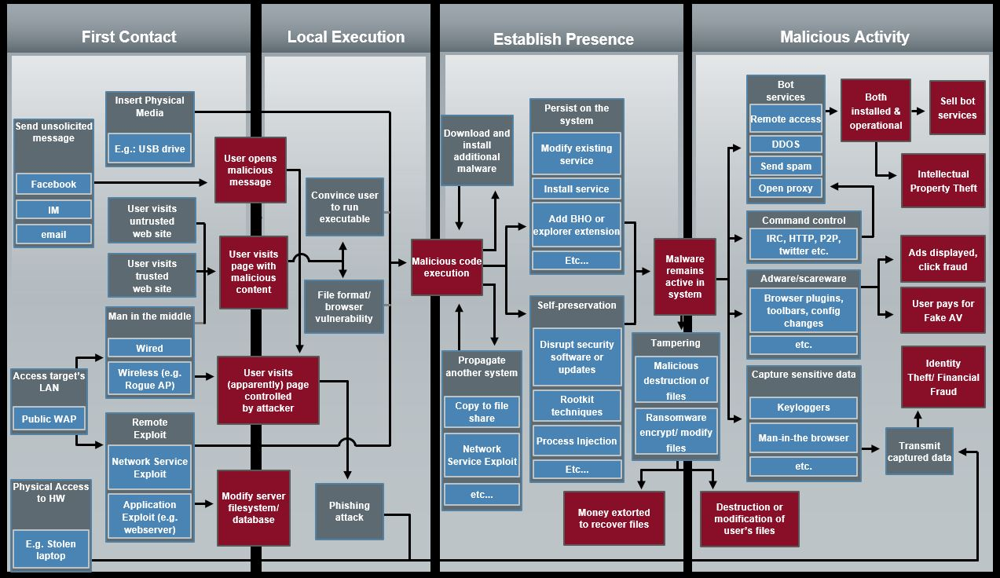
 

Then, we shifted thought from how malware attacks, towards what steps can we take to block the attacks. Some examples of steps that can be taken at each attack stage are included below. Note there is overlap of blocking steps between the different attack stages. There is no one-all solution, so defense in depth is the preferred strategy.

First Contact: Web reputation, anti-spam, firewalls, limiting physical access

Local Execution: Content filtering, network IPS, anti-virus, whitelisting

Establish Presence: Anti-virus, whitelisting, firewalls, network IPS, web reputation

Malicious Activity: Anti-virus, firewalls, network IPS, web reputation and content filtering, data loss prevention
 

### YARA

YARA is an open-source tool used to identify malware using pattern matching. A simple example from Lab 1 demonstrates that we can find a common string, "Jenna J", amoung several malicious files. The goal is to detect the malicious files, exclude any false-positives during the system search, while keeping your rules search criteria small so that it minimizes the file size of the yara files. Typically, you would want to include more than one rule so as not to catch false positives.

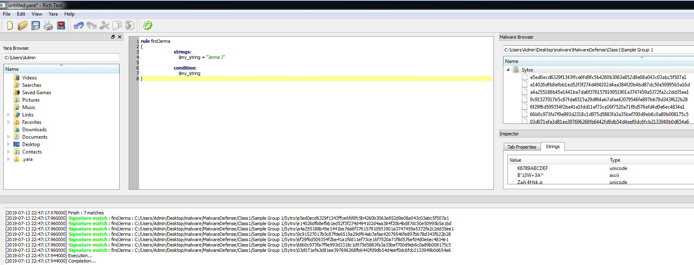

The yara editor has the ability to generate rules by comparing selected files in the same family. It is not able to compare substrings, so the above example of "Jenna J" was not found using the generate tool. Several of the strings found are common system calls that could lead to false positives. But this tool can be used as a starting place to look for common strings amoung files. FileInsight is also useful for looking for common strings.

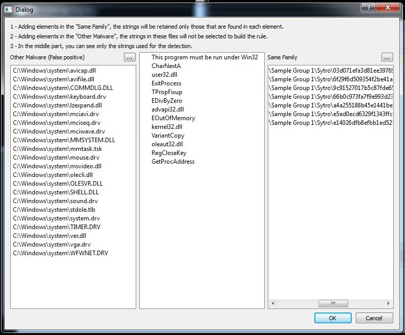

Once the yara rule is written and saved, we can check to see if it will detect legitime files in the system (false positives) by running yara in the command line. If no files are returned, then the rule covered no files in the specified directory.

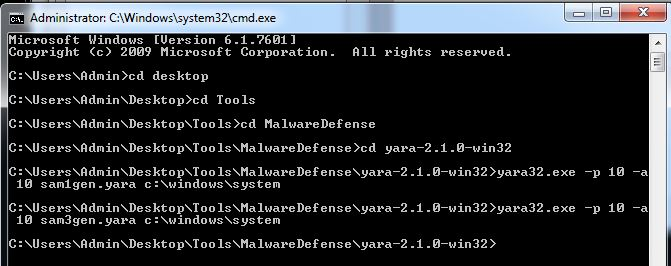

### Automation and Cuckoo

The need to automate malware detection exists due to the increasing number of threats (over half-a-million new malicious binaries discovered each day as of 2014), scalability, and the reduction of human error. Cuckoo is an open source automated malware analysis system (https://cuckoosandbox.org/) that can take almost any type of file as input and run on it on a number of vm's. 

We ran Cuckoo with the malware file provided in our very first lab (evil.exe), by first placing a copy of it on our vm's desktop and renaming it "bad" with no file extension. Then, navigating to "c:\analyzer" on the cmd line and running analyzer.py. FakeNet was started after running analyzer.py. Then we examined the csv logs recorded by Cuckoo.

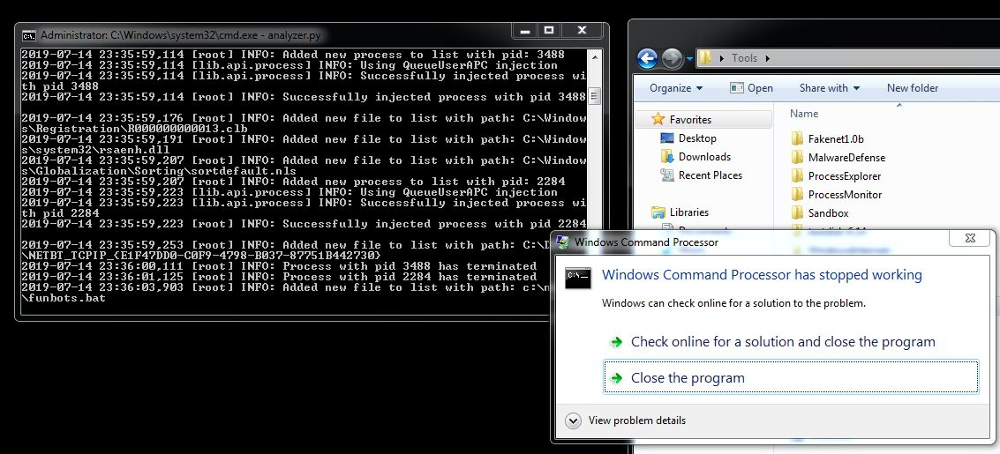

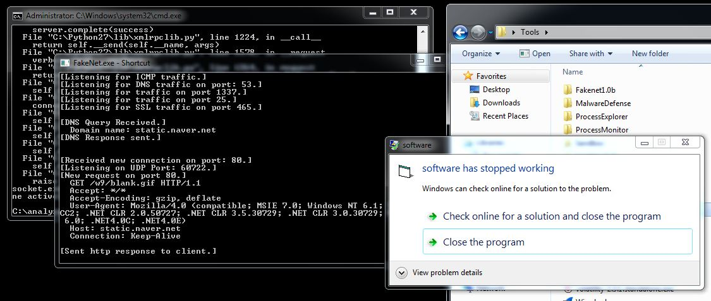

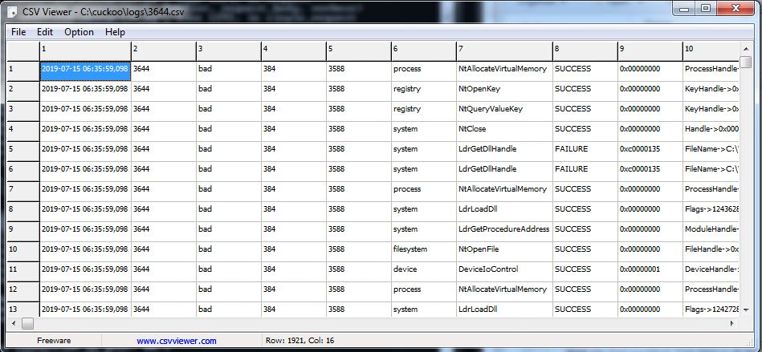

For Class 2 of this week, we were assigned to use any tools that we have learned to date to determine if each of the four files provided were clean or malicious.

With the samples Desktop\malware\MalwareDefense\Class2:

a1874f714f7a15399b9fae968180b303 : malicious, described in below blog
4844fd851088a11e240cfe5b54096209 : possible adware
068d5b62254dc582f3697847c16710b7 : malicious
068d5b62254dc582f3697847c16710b7 : malicious
 

## MalBlog
Katie Gassaway
7/14/2019 23:30 EDT

md5 hash: a1874f714f7a15399b9fae968180b303

The above hash belongs to some malware that appears to be some sort of Trojan.

Using Cuckoo, the file messes with the registry keys to persist.

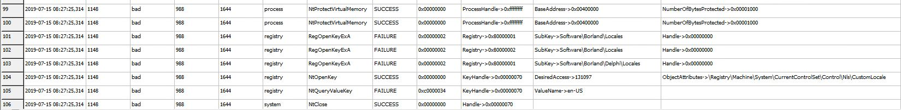
 

Using FileInsight, the file is a PE, obviously packed ("UPX"), and parts written in Delphi (language often used in malware). PUMaskValue is used for permission setting. 

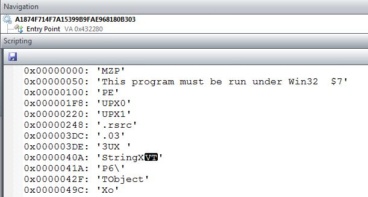
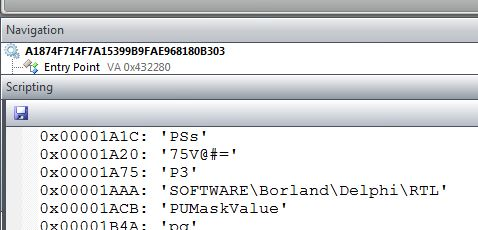
 

Four dlls are imported.

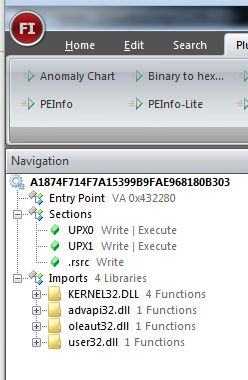
 

Several files are written to in the C:\Users\Admin\AppData\Local\Temp directory. 

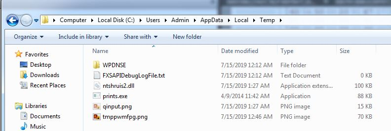
 

Once these hidden programs are created the initial executable is deleted.

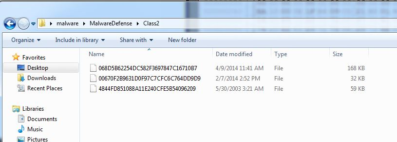
 

The file prints.exe appears to be a copy of the initail executable.

The file qinput.png looks to be an image of Tecent's QQ instant message software, which is a social platform from China (https://www.huffpost.com/entry/meet-tencents-qq-penguin_b_5963a401e4b08f5c97d06b97). Perhaps the malware is attempting to use this platform to export information.

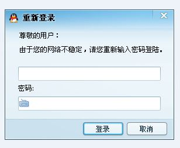
 

The ntshruis2.dll is actually an executable that is also written in Delphi. It appears to be reading the process memory. Then appears to set up and/or look for a Tencent QQ user account. It then calls the prints.exe, and then makes a http GET request to TJ.asp?whileInject. The malware attempts to keep a online connection alive via Mozilla. Then it appears to make several http requests that  link to a QQ acount to pay for some service.

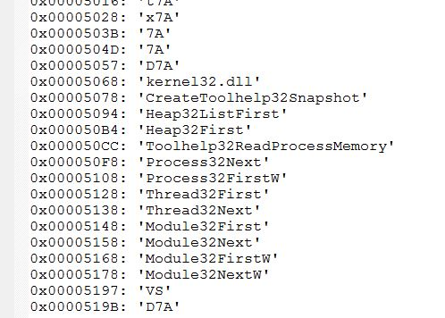
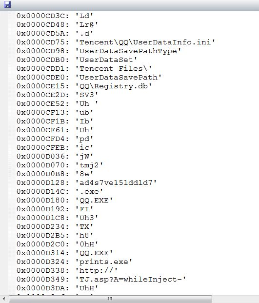
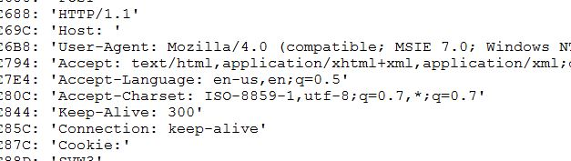
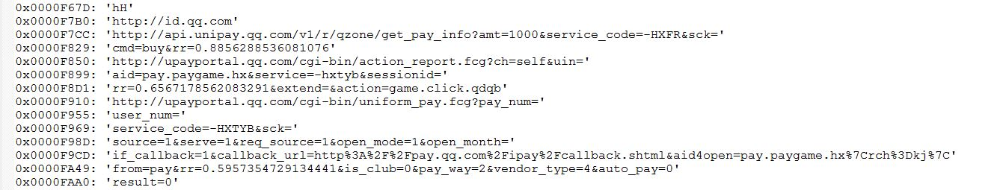
 

The following image shows my yara signature for this malware and it did not hit any windows system files.

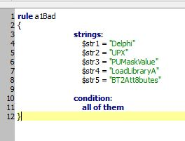
 

### References
Schmugar, Craig, IntelSecurity/McAfee Labs, *Malware Defense*, OSU CS-373 DEFENSE AGAINST THE DARK ARTS

