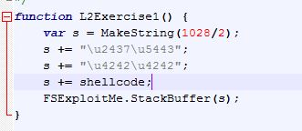

## DEFENSE AGAINST THE DARK ARTS
### CS373 - SUMMER 2019
 
[Week 2](index.md)  [Week 3](week3.md)

  
## Week 4 Write-Up:  Software Vulnerabilities and Exploits

### Using WinDBG

Using WinDBG, a standard debugging tool, we can view assembly level processes occuring while running a malicious executable. Since there has been an increase in browser based attacks over the past several years, we will examine code that attempts to exploit website and browser based vulnerabilities.

Once FSExplorer.html is open and we allow scripts to be run, we attach the tab process (second process to be executed when launching Internet Explorer) in WinDBG, set a breakpoint, and allow the code to execute till we reach the breakpoint. From here, we can view where the module is loaded in memory using the lm or lmf command in WinDGB. FSExploitMe is loaded at 54430000. We can also determine stack size, starting address of heap, view register values, determine amount of space allocated for local variables on the stack, view string values on the stack, view different formats of values, view the call stack, and lots more.

 

Go [here](http://windbg.info/doc/1-common-cmds.html) to see a list of common WinDBG commands.

Go [here](https://docs.microsoft.com/en-us/windows-hardware/drivers/debugger/x86-architecture) to learn about x86 architecture, including how the internal registers are used.
 

### Memory Corruption

A popular vulnerability to exploit is memory corruption. There are a few different categories of memory corruption which can result in undefined behavior. Buffer overflows can be used to determine internal registry offsets and give hackers control flow of program. Simply put, not checking lenghts of inputs can lead to hacks. The buffer overflow is the vulnerability trigger and then the payload, or shell code, with the malicious code can be executed.

To demonstrate, first we use the msfPatternString - a nonsequential string that when given a segment of the string, one can determine the starting and end postion of that segment - to pass to the stack.

 

When we trigger the vulnerability, we see an access violation in WinDBG. We can load buakugan, and give the pattern offset to see the offset for eip. The register eip, or instructor pointer, is necessary to gain control of a system because it points the current instruction. If you can find the offset of eip, you can point it to executable code. Here the offset for eip is 1028.

 

The function MakeString returns 2 bytes for each 1 requested. So to get to the offset of eip we need to make a string passing it half the value of the offset. Then we make the eip register a value of our choosing (here we use "42424242"). Remember that x86 uses little-endian order and we pass it the value with the "\u" for unicode.

 

The result is that ebp is overwritten with "41414141" and eip with "42424242". So we have verified we know the exact offset of eip. [Golf clap]

 

I used to love to trampoline as a kid. Who knew I would get back on one in class?! Now that we know where eip is hiding, we use what's called a trampoline to get eip to point to some executable code. We find an address in memory that contains the substring "ff e4", which is interpreted as the command "jmp esp". If eip is pointed to such a memory location, the next process to be called will be at location esp. 
We can do a search of the modules to find a memeory location that contains "ff e4" (Location 54432437).

 

At the offset of the eip, we write the memory location that contains "ff e4", remembering that x86 uses little-endian order. Because there is an instruction that removes 4 bytes off the stack after epb is popped, we need to add some trash between the trampoline and the code we want to execute. We then write shell code on the stack.

 

Calc.exe! 

 

### References
Antoniewicz, Brad, Foundstone, *Vulnerabilities and Expoits*, OSU CS-373 DEFENSE AGAINST THE DARK ARTS

