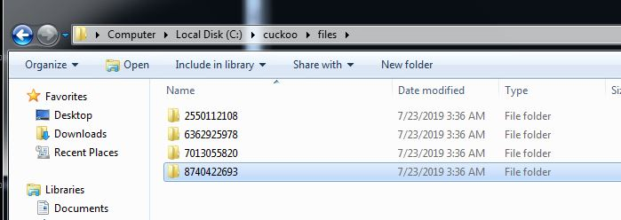
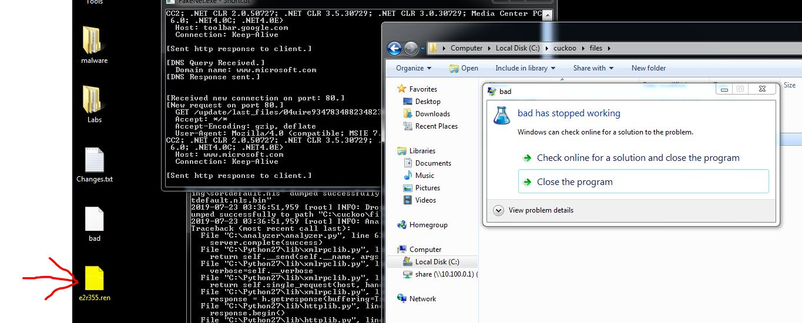
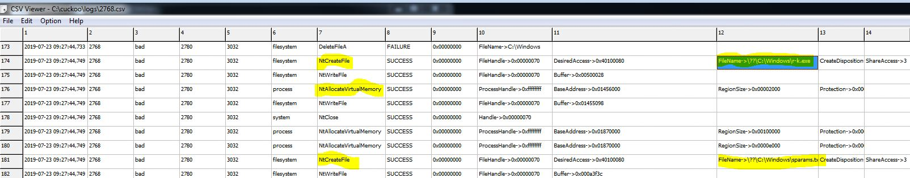
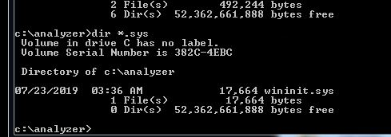
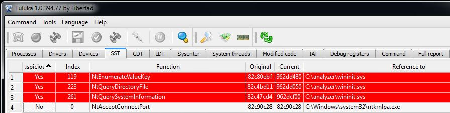
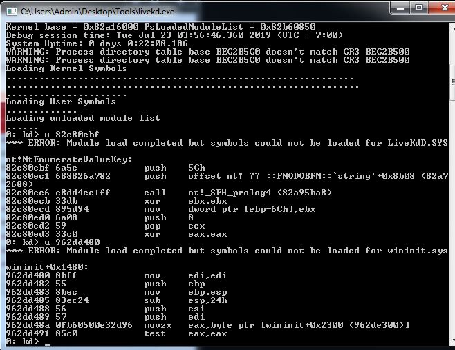
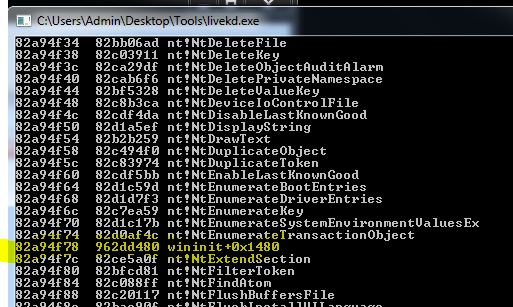
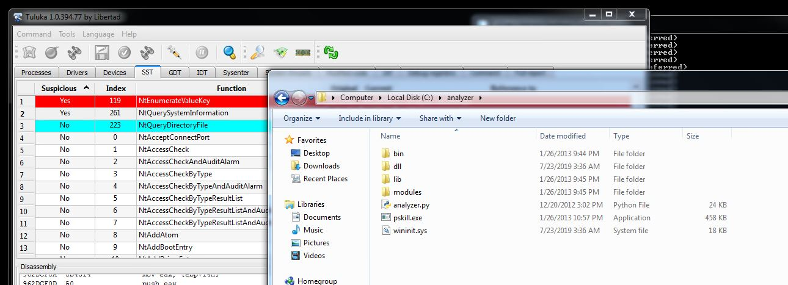
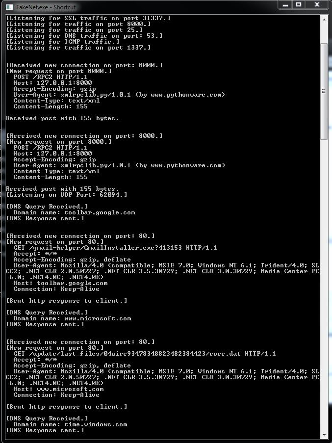

## DEFENSE AGAINST THE DARK ARTS
### CS373 - SUMMER 2019
 
[Week 2](index.md)  [Week 3](week3.md)  [Week 4](week4.md)

  
## Week 5 Write-Up:  Windows Memory Manipulation

### Examine a Simple Rootkit

Rootkits are used to hide and protect malware on a computer, and themselves are not typically harmful - it's the malware they hide that is (https://www.vipre.com/resource/what-are-rootkits/). If a user or AV can't see/read the malware, it makes detecting and removal much more difficult. To provide stealth, the rootkit infiltrates the operating system kernel and performs memory manipulation.

Let's examine the rootkit Agony. Using the tool Cuckoo, the rootkit appears to have created 4 files: bad.bin, tzres.dll.bin, sortdefault.nls.bin, tzres.dll.

 

However, a popup "bad has stopped working" appears the same time as a file, e2r355.ren, on the desktop.

 

Also, if we examine the Cuckloo log, we see files r-k.exe and sparams.txt are created in the Windows directory.

 

Using "dir \*.sys" on the command prompt in the c:\analyzer directory, there is the file wininit.sys hiding.

 

Most of the above files are hidden from the user. The rootkit has kept the files from rendering by using hooks. Hooking replaces some of the instructions in the kernel processes with another set of instructions at a different memory location. The tool Tuluka can detect hooks using a System Service Descriptor Table (SSDT) on Windows 32-bit OS. Here we see three kernel processes that have been hooked. NTQueryDirectoryFile is used to render directory files, NTEnumerateValueKey is used to enumerate registry keys, and NTQuerySystemInformation is used to retrieve system information. 

 

Using LiveKD, a debugger that reads Windows kernal memory, we can examine the instructions at the memory locations for the above kernel processes and see that there is a pointer referencing the wininit.sys file discovered previously. If we list all system APIs, we see wininit listed again and the memory address it is located, which is outside of the kernel processes memory location.

 

 

The offset of the instruction from the beginning of the function boundary wininit+0x1480. This instruction has replaced the original instruction of NTEnumerateValueKey. The offset wininit+0x1050 is the beginning of the instructions that have replaced NTQueryDirectoryFile. And the offset wininit+0xf00 is the beginning of the instructions that have replaced NTQuerySystemInformation.

If we right-click on these kernel processes in Tuluka and hit enable, the hook should be removed at least temporarily. 

 

FakeNet did capture network traffic attempts: a POST to /RPC2, a GET request to /gmail-helper/GmailInstaller.exe, and a GET request for a microsoft .dat.

 

### References
Kapoor , Aditya, Intel Security, *Windows Memory Manipulation*, OSU CS-373 DEFENSE AGAINST THE DARK ARTS
