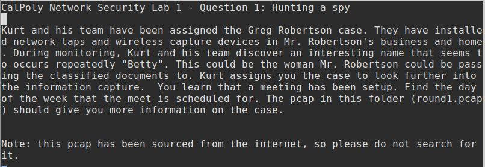
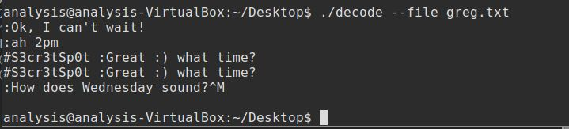
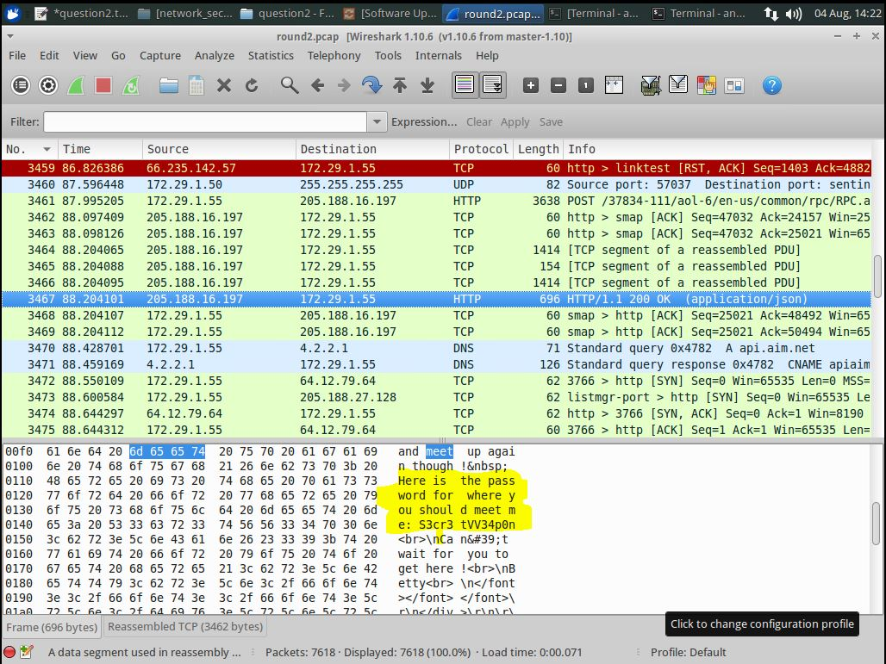
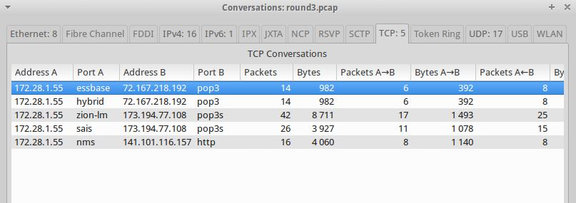

## DEFENSE AGAINST THE DARK ARTS
### CS373 - SUMMER 2019
 
[Week 2](index.md) [Week 3](week3.md) [Week 4](week4.md) [Week 5](week5.md) [Homework 3](homework3.md) [Week 7](week7.md) 
[Week 8](week8.md) [Final](final.md)

  
## Week 6 Write-Up:  Network Security

### How has Network Security Changed from 35 Years Ago

Jonathan Postel wrote an RFC in 1989 on the Robustness Principle. See [RFC 2468](http://tools.ietf.org/html/rfc2468). Let's review it and see what parts are still valid today.
 

 

*	Today, if you accept input liberally, then you could be accepting invalid protocol that may be able to break into your system. 
*	However, you should expect that other systems are conservative in what they accept
 

 

*	Security has shifted more to a layered approach, called defense in depth. With the speeds at which we expect things to work, having a single software or network layer deal with any and all conceivable errors is unrealistic. Instead use a combination of best security practices at each network layer. In addition, use firewalls to block traffic that is not in alignment with your policy. There are infinite possibilities of error, but a finite set of acceptable behaviors. Don’t be liberal with what you accept, be conservative to “head the malicious code off at the pass”.
*	It is good to assume that there are lots of malevolent entities out on the network simply because there are.
 

 

*	You need more than this assumption to come up with suitable protective design. However, assuming there’s people out there to get you is a good assumption.
*	Bugs in software have no doubt lead to catastrophic events, but malevolent entities have been and continue to become more sophisticated in their attacks, and more numerous. I have been affected by the Target, Home Depot, Equifax, and a few other breaches (one that my bank was unwilling to share information on). 
 

 

*	Use firewalls and define policies and input that are acceptable, and block or send alerts on traffic that is not defined as acceptable. 
 

 

*	The Golden Rule should apply when transmitting data. If you expect others to use up-to-date and valid protocols, do so yourself.
 

### Firewall Policies

Firewalls filter traffic between zones and look for suspecious activity using a set of rules that define actions based on zones and protocols. Whitelisting allows for traffic that is expected or permitted, and is finite, and is used in setting firewall policy. Some blacklisting can be used as well, however there are an infinite number of possible errors so it should be relied less upon in setting up firewall policies.
 

 

 

### Wireshark

Wireshark is a useful tool that gives us the ability to analyze network traffic. In this example we are given some network traffic between two suspected spied. We are to use TrueCrypt, Wireshark, and a decoding script to determine when and where they are to meet.
 

 

Malevolent users sharing messages over the network will often use url encoding to make it more difficult to intercept the message. If we decode parts of their captured packet data and decode the url encoded strings, we see that the two suspects intend to meed Wednesday at 2pm. (Note the messages are not in order).
 

 

We weren't able to find where the suspects plan to meet given the previous packet data. Using Wireshark we can search for packets that contain the word "meet". But those sneaky devils are using a password for where they intend to meet up.
 

 

Your coworker has hacked one of Betty's (Betty and Greg are the suspects) emails and now suspects his system is infected. He was capturing packets while this ocurred. Again, using Wireshark we can look at the TCP conversations and see the email traffic using pop3 protocal, and http which is likely the protocol used to infect your coworkers computer. The malicious payload apears to be 4,060 Bytes.

 

### References
Venugopalan R., Cooper G., Intel Security, *Network Security*, OSU CS-373 DEFENSE AGAINST THE DARK ARTS

