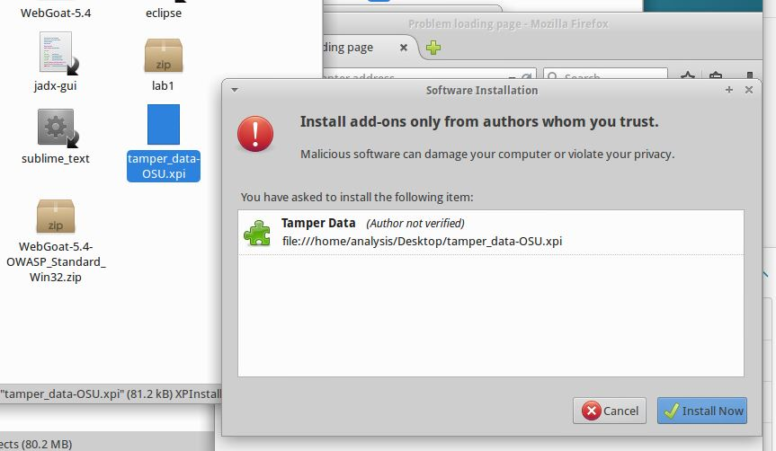
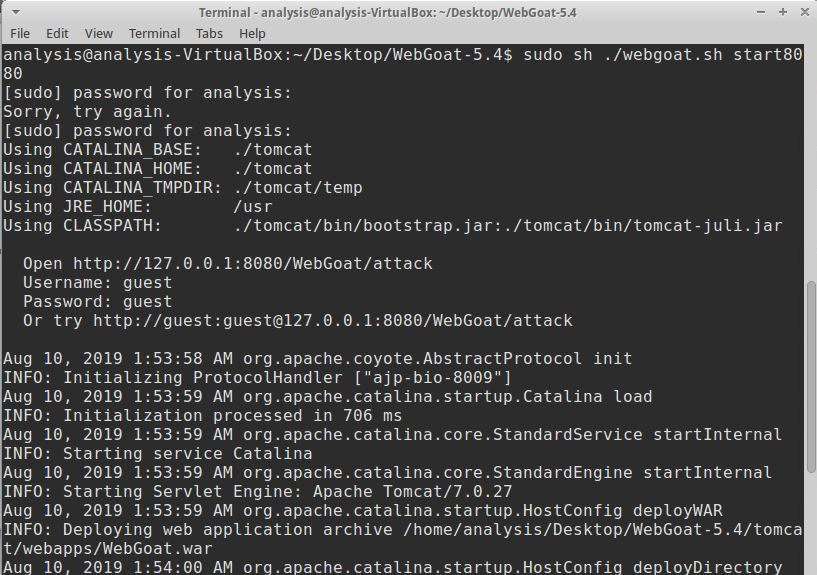
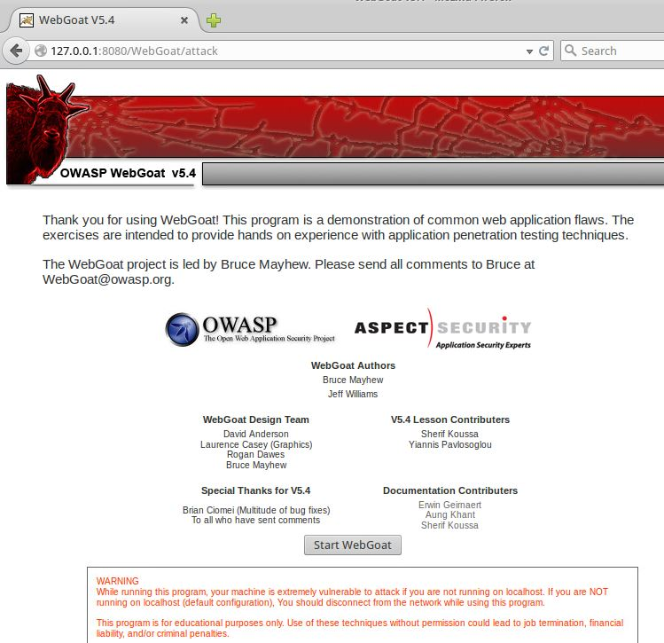
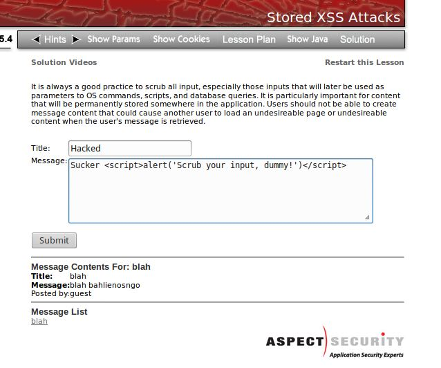
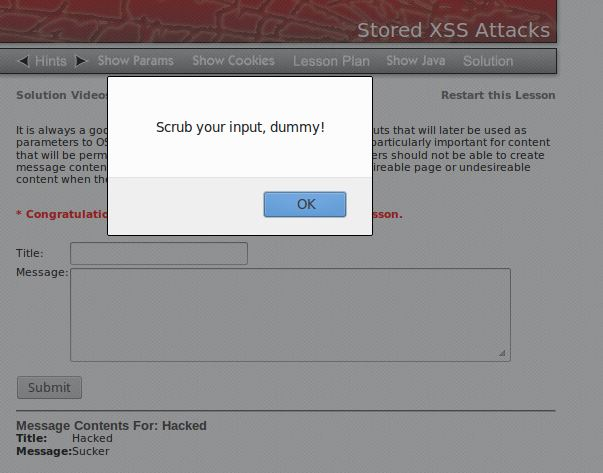
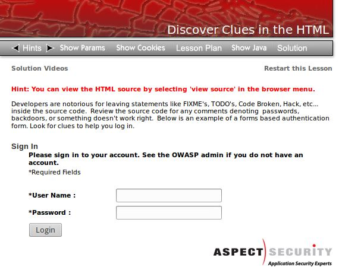
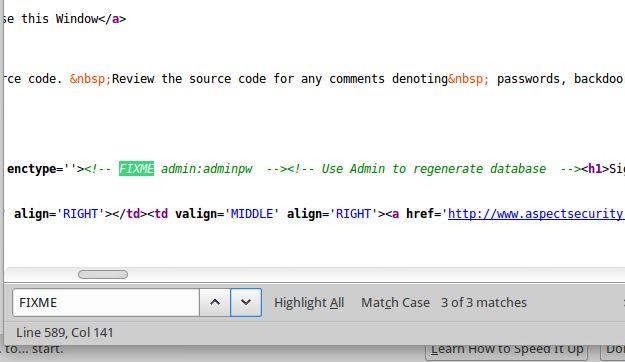
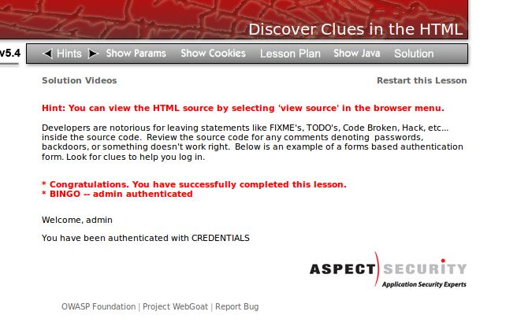
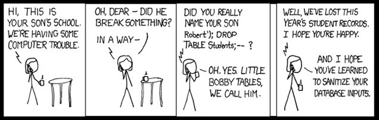

## DEFENSE AGAINST THE DARK ARTS
### CS373 - SUMMER 2019
 
[Week 2](index.md)  [Week 3](week3.md)  [Week 4](week4.md)  [Week 5](week5.md)  [Week 6](week6.md)  [Homework 3](homework3.md)
[Week 8](week8.md) [Final](final.md)

  
## Week 7 Write-Up:  Web Security

### WebGoat

WebGoad is a deliberately insecure web application mainained by OWASP designed to teach web application security lessons (https://www.owasp.org/index.php/Category:OWASP_WebGoat_Project). Lessons provide users with a safe place to practice hacking as well as exercises to prevent attacks. The site offers hints and the solutions are available if the user gets stuck.

There is some setup to be able to use WebGoat. In the vm, extract the OSU tamper data and WebGoat files, open FireFox , and install the tamper data to FireFox and restart the browser. 

 

Delete the if block that looks for the Java path in webgoat.sh. Get WebGoat running on the terminal with "sudo sh ./webgoat.sh start8080". 

 

Navigate to the link provided in the terminal to get to WebGoat.

  

### Stored XSS Attacks

Cross-Site Scripting (XSS)'s goal is to inject client-side script into other user's browsers by injecting malicious code into a vulnerable web application. The users of the application are the targets, not necessarily the application. 

Stored XXS is persistent and is more dangerous than non-persistent (https://www.imperva.com/learn/application-security/cross-site-scripting-xss-attacks/).

If we enter script in a web application form, whose input is not scrubbed, we can create a XSS attack. We could install malicious code on users devices, but let's create a popup instead.

 

  

### Discover Clues in the HTML

Most browsers come with developer tools that allow the user to change client-side code. For sign-in pages this can be particularly dangerous as developers will often leave clues on how to get through a backdoor or if there is some sections needing fixed. If we search the source code for works like "password", "todo", "fix", we migh be able to hack our way through the sign-in.

 

We see that the admin username and password is made available in the source code. This should get someone fired.

 

Signing in as admin, we can do just about anything.

  

### SQL Injection

SQL injection takes advantage of the fact that most sites are database driven, and accept user input via GET or POST, most sites authenticate via db. By injecting SQL code attackers can circumvent authentication, get access to data, and in some circumstances execute shell commands.

There are several types of SQL injection. An example of numeric SQL injection is to append a statement that resolves to be true (OR 1=1)in an input field. Other methods may inject SQL strings such as " or ""=", or *Robert'); DROP TABLE Students;*. This could get you through authentication, have the application lose data, or return data that you don't have access to.

The lesson is to use parameterized quiries and escape embeded strings.

  

### References
Cochin, Cedric, Intel Security/McAfee Labs, *Web Security*, OSU CS-373 DEFENSE AGAINST THE DARK ARTS

