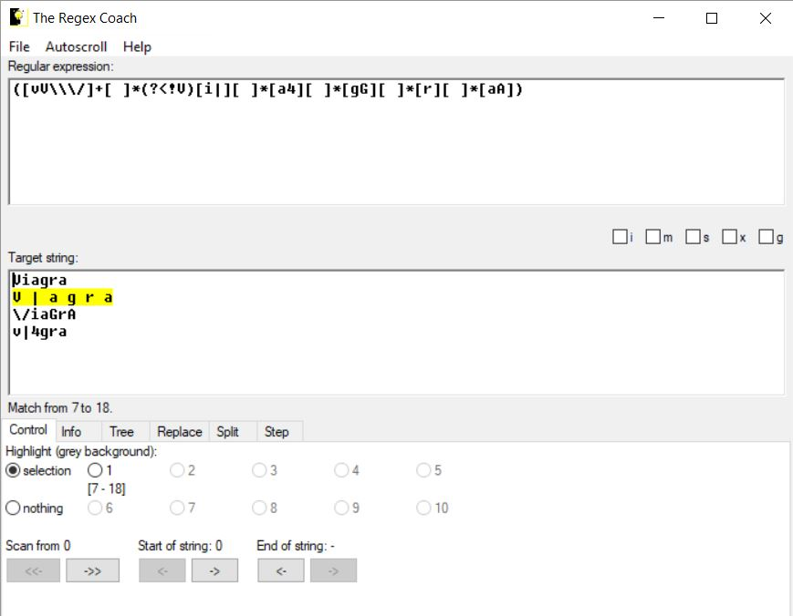

## DEFENSE AGAINST THE DARK ARTS
### CS373 - SUMMER 2019
 
[Week 2](index.md)  [Week 3](week3.md)  [Week 4](week4.md)  [Week 5](week5.md)  [Week 6](week6.md)  [Homework 3](homework3.md)
[Week 7](week7.md) [Final](final.md)

  
## Week 8 Write-Up:  Messaging Security

You may never have had to deal with malware infecting your computer but if you own an email account, you have seen spam and have been a target of phishing attempts. 
  

### Spam

Just like your physical mailbox, your inbox is sent more junk (spam) than good mail (ham). It's the job of anti-spam software developers to find methods to filter the spam out so you are just left with ham, but while also not filtering out ham, or false-positives. 

Spam can be filtered by using a few different methods. The reputation of the IP of the sender or the reputation of the urls included in the message can be used. The content of the message can be used to identify it as spam as well, by looking at strings and/or features of the message.
  

### Phishing 

Phishing is used to get the recepient to divulge information such as passwords, credit card numbers, or personally identifiable information (PII), and accounts for 90% of data breaches (https://retruster.com/blog/2019-phishing-and-email-fraud-statistics.html). Often the messages look legitimate and may even appear to be from a trusted sender (by way of email spoofing or use of cousin domains). The message may include a link or attachment, and often in an urgent tone asks the receiver to provide information ("a call to action"). 

Sometimes the link may be within an attachment but because spam filters cannot reasonably open email attachments and look for links, it is extremely difficult for filtering software to detect these types of attempts. Hovering over links to see what url the link actually points to, double checking where the message came from, and simply taking a minute to observe the attributes of a message could save you or your company loads of time and money.
  

### The Regex Coach

The Regex Coach is a tool that can be used to match target strings that may appear in recognized spam or phishing messages using regular expressions. Similarly to how we built yara rules for AV in week 3, we can filter for strings with Regex; however, Regex can match fixed and variable strings. For instance, if we want to match all the following variations: 

V | a g r a
 
\\/iaGrA
 
v|4gra
 

but exclude Viagra (not my example), we could use the following regular expression:

([vV\\\/]+[ ]\*(?<!V)[i][ ]\*[a4][ ]\*[gG][ ]\*[r][ ]\*[aA])

Alphaneumeric characters within the brackets [] are or'ed. The asterix after the space within the brackets, [ ]\*, means that any number of spaces can be evaulated to true - the quantifiers \* + and {} are called a greedy operators and can substantially slow down the filtering speed. And to negate matches if a character (y) is preceded with another character (x), we use (?<!x)y.
  

### References
Peterson, Eric, Intel Security/McAfee Labs, *Messaging Security*, OSU CS-373 DEFENSE AGAINST THE DARK ARTS

